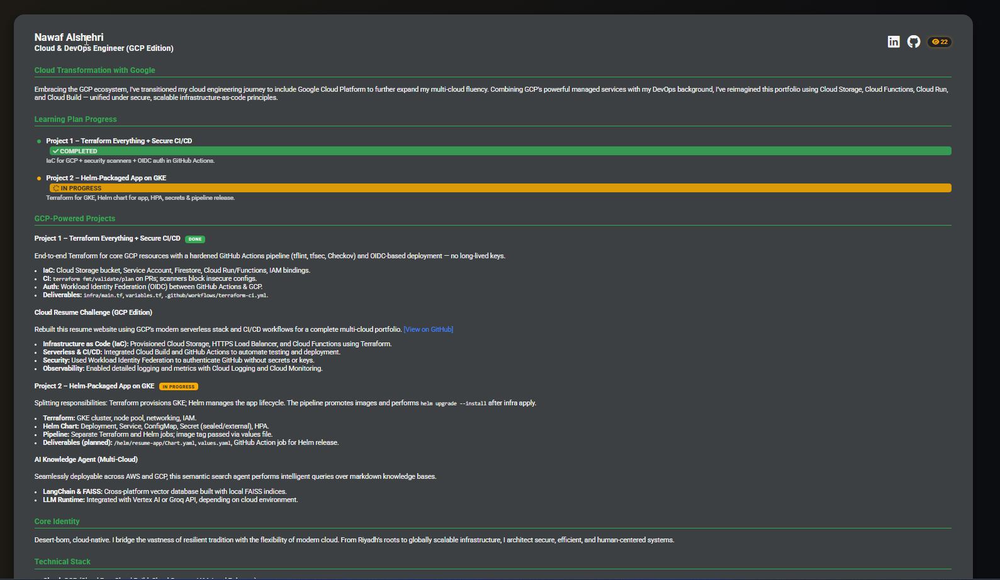

# ☁️ Nawaf Alshehri · Cloud Security & DevOps Engineer (GCP Edition)

> **Desert-born, cloud-native.**  
> A hands-on portfolio that merges Saudi-inspired design with cutting-edge multi-cloud, security-first engineering.

 <!-- click to view live site -->

☁️ Nawaf Alshehri · Cloud Security & DevOps Engineer (GCP Edition)

Desert-born, cloud-native.A hands-on portfolio that merges Saudi-inspired design with cutting-edge multi-cloud, security-first engineering.

 

🚀 What’s inside

Layer

Tech Highlights

Frontend

HTML5, vanilla CSS (dark gradient theme), Font Awesome

Infrastructure (paused)

Terraform ⇒ GCP (Cloud Run / Functions, Cloud Build, Firestore, IAM)

CI/CD

GitHub Actions with OIDC → GCP, SBOM generation & security scanning

Hosting (current)

GitHub Pages – static “oasis” mode until Google’s free tier reaches the Saudi region

📜 Roadmap

✔️ Project 1: Everything-as-Code + Secure CI/CD

🔄 Project 2: Helm-packaged app on GKE (in progress – see banner on site)

☁️ Reactivate dynamic visitor counter once GCP free tier lands in the Middle East

Made with ☀️ + ☁️ Connect on LinkedIn · Follow on X
